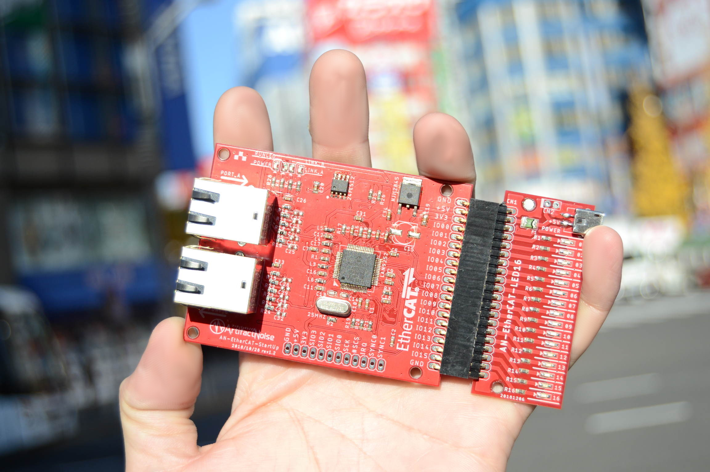

===================================================
EtherCAT 開発日誌
===================================================

　
はじめに
---------------------------------------------------

このサイトは、産業用通信規格であるEtherCATの開発を行う際にメモした内容です。

EtherCATは、数ある産業用通信規格の中の一つで、民生用のPCで使用されている有線LANを使用し、
特別な機械を付けづに産業機器を制御出来る仕組みです。他にも利点があり、EtherCATの特徴として
「冗長性ある通信」「高速伝送」「同期動作」「その他の通信規格をラップする仕組み」などがあります。

EtherCATについては公式の内容を参考にしてください。

https://www.ethercat.org/jp.htm

対象モジュール
---------------------------------------------------

.. toctree::
    :maxdepth: 1

    rst/M01
    rst/M02

目次
---------------------------------------------------

.. toctree::
    :maxdepth: 1

    rst/S01
    rst/S02_1

- 第2章-2 EtherCATの通信について

- 第3章   EtherCATのプロトコルについて

- 第4章   EtherCATを動かしてみよう

- 第5章   EtherCATライブラリについて

- 第6章   EtherCATで自作ハードウェアを接続してみる

- 第7章   EtherCAT-Pの規格について

- 第8章   EtherCATの得意分野、不得意な分野

- 第9章   EtherCAT応用事例集

※以上の内容は常に変化と変更があります。書かない場合もあります。書籍化になる場合もあります。参考程度に。

コラム
---------------------------------------------------

.. toctree::
    :maxdepth: 1

    rst/C01
    rst/C02

- Windowsで試す方法（調査中)

- MacOSで試す方法（調査中)

購入サイト
---------------------------------------------------

- `EtherCAT GPIO16ポート LAN9252使用評価ボード <https://artifactnoise.stores.jp/items/5c545082aee1bb192c4182eb>`_

- `EtherCATモジュール用LEDx16ボード <https://artifactnoise.stores.jp/items/5c545193aee1bb37ea418289>`_

著者について
---------------------------------------------------

本開発日誌は、ArtifactNoise,LLPに所属する北神が書いております。
 
ArtifactNoise,LLPは、EtherCATのメンバーとして登録されてます。

https://www.ethercat.org/jp/members/members_02F13528E14E4087BDE04CA4664FE382.htm

また、ベンダーIDも取得し、製品の開発についても前向きに検討しております。

ArtifactNoise,LLP

-----------------------------------------------------------------
管理情報
-----------------------------------------------------------------
:管理者: 北神 雄太(Yuta Kitagami)
:連絡先: kitagami@Artifactnoise.com
:公開日: 2019/01/30 
:更新　: 2019/02/05
:更新　: 2019/05/13   モジュールの説明追加

.. raw:: html

    <meta name="google-site-verification" content="ZZJWIExpSI4kqI2OdgaFy0BoygvFoBtrRHVR7wK2lBM" />

