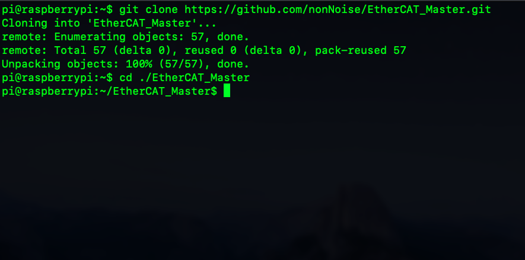

=================================================================
コラム　RaspberryPiでEtherCATを動かそう！
=================================================================

RaspberryPiはLinuxを搭載しており、手軽にネットワークの勉強を行う上で最適なOSであり、
邪魔なセキュリティールール等はなく気軽に試すことができます。

:対応モデル: RaspberryPi 3B+, 3B, 2B
:対応OS: Rasbian OS

- 1. ArtifactNoiseが作成したEtherCATモジュールを買います。

.. toctree::
    :maxdepth: 1

    M01
    M02

- 3. RaspberryPiに電源を入れ、WiFiよりSSHアクセス、もしくはシリアルポート、デスクトップよりマウスでコンソールを立ち上げます。

.. image:: ../img/DSC_3487.jpg
   :scale: 10%

|

- 4. LEDボードをピンソケットへ接続し、USB端子にMicro-Bを接続します。

USBは電源供給のみ行います。RaspberryPiの余っているUSBポートに接続します。

.. image:: ../img/DSC_3488.jpg
   :scale: 10%

|

- 5. Githubより、以下のリポジトリをダウンロードします。

コンソールを開く

    git clone https://github.com/nonNoise/EtherCAT_Master.git

    cd ./EtherCAT_Master

    sudo python3 test.py

|

- 6. RaspberryPiにLANケーブルを接続し、EtherCATにもLANケーブルを接続する

  EtherCATでは、PortAがマスター側と規定されているため、PortA（写真では下側）のLANコネクタに接続します。

  .. image:: ../img/DSC_3489.jpg
   :scale: 10%

|

- 7. EtherCATボードのLINC-AのLEDが点滅することを確認します。

  .. image:: ../img/DSC_3489.jpg
   :scale: 10%

- 8. 以下のコマンドを実行します。

.. image:: ../img/testpy.png
   :scale: 10%

|

- 9. 無事にうまく通信ができれば、RUNが点灯し、16個のLEDが点灯すると思います。

.. image:: ../img/DSC_3487.jpg
   :scale: 10%

|

|

|

■ 管理情報

:管理者: 北神 雄太(Yuta Kitagami)
:連絡先: kitagami@Artifactnoise.com
:公開日: 2019/02/05 
:更新日: 2019/02/05