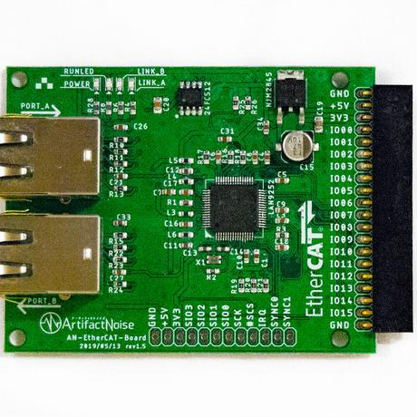
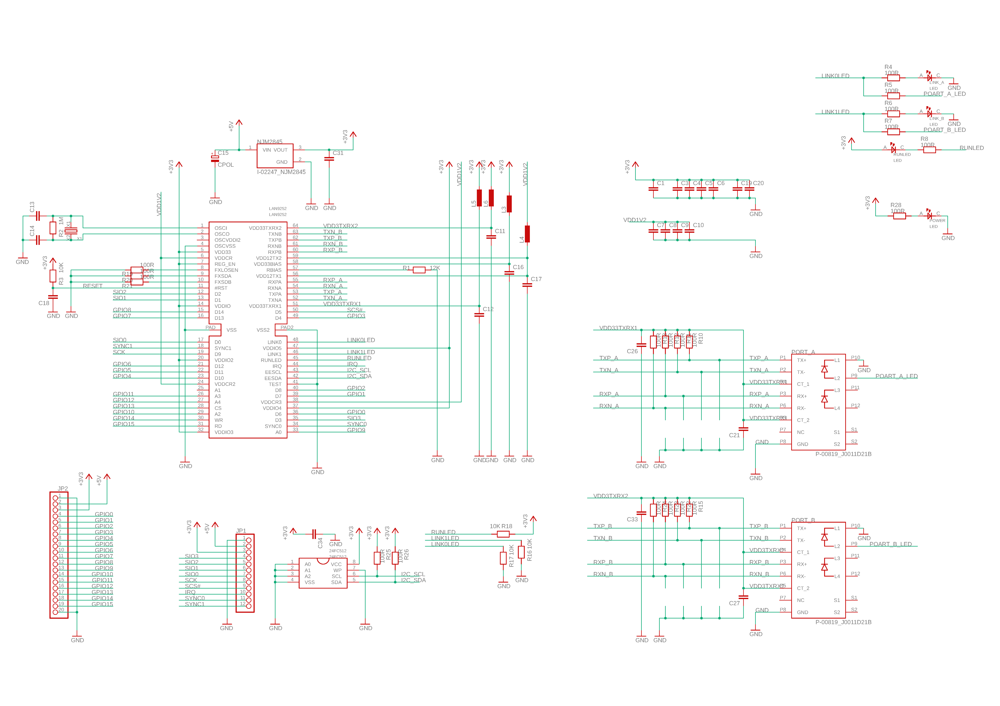

=================================================================
AN-201　EtherCATスレーブ評価基板　使い方
=================================================================

■　概要
---------------------------------------------------

手取り早くEtherCATにて通信テストを行う際のもっとも単純なEtherCAT Slaveモジュールです。

マイコン不要でEtherCATの通信でGPIOx16(3.3V)を制御することが出来ます。

EtherCATの情報を記録するEEPROMもボードに搭載してあり、自由に変更も可能です。

■　購入
---------------------------------------------------

- `EtherCAT GPIO16ポート LAN9252使用評価ボード <https://www.switch-science.com/catalog/5917/>`_

■　セットアップ
--------------------------------------------------

- EtherCATモジュールにLEDモジュールを接続する。

- LEDモジュールはこちら `EtherCATモジュール用LEDx16ボード <https://www.switch-science.com/catalog/5918/>`_

- LEDモジュールを使用しない場合は、ピンソケットに電源5Vを供給する。

- POWERのLEDが点灯する事を確認

■　PC側のセットアップ
--------------------------------------------------

EtherCATは一般のPC(Linux)に付属する有線LANを使って通信を行います。

物理的なセットアップは、

- PC(Linux)の有線LANポートにLANケーブルを接続する。

- その有線LANを直接 EtherCATのAポートに接続する。

- EtherCATのアクセスランプの点滅を確認する。

- Linux側では有線LANが接続されたが、インターネットへは未接続といったアラートが出る。（問題ない）

続いて、ソフトウェアの準備です。

- コンソールを開く

- git clone https://github.com/nonNoise/EtherCAT_Master.git

- cd ./EtherCAT_Master

- sudo python3 test.py

これでモジュールが点滅したりします。

※上手く行かない際のアドバイス

test.pyの
cat = EtherCAT_Init("eth0")    # EtherCATのネットワーク初期設定
にてNICカードを選択してます。LinuxPCで通信を行うNICの名前に変更して下さい。

※　Windows,Macでは動きません（なぜですか？）

Windows,Macでは、Socet通信に制限がかかっています。特に、EtherCATの宛先不明のパケットは受信する際にドライバで弾く用になっています。
その為、公式のソフトやその他の仕組みは「パケットキャプチャ」等で使用する特殊ドライバを経由し、パケットを読み取るように行っています。
現在、その方法に対して当方の開発が間に合っておらず、純粋にパケットを受信するLinuxを使って開発を行っております。
WindowsやMacOSにてご要望がある際は、以下のアドレスもしくはTwitter(@nonNoise)までご意見いただければ頑張りたいと思います。

※その他、上手く行かない際は以下の問い合わせよりご連絡下さい。

info＠artifactnoise.com　（アットマークを半角にしてください）

■　ピンアサイン
--------------------------------------------------

:ボード電源: 5V
:IC駆動電圧: 3.3V
:EEPROM: 24FC512
:I/O電圧: 3.3V
:EtherNetケーブル: Cat5以上

.. image:: ../img/pin_assin.png
    :scale: 80%

★　20ピンソケット

:GND: GND
:+5V: 電源供給用
:3V3: レギュレータ(最大800mA)より出力
:I/O 00: 入力および出力端子（使用するにはEEPROMに入出力設定を書き込む必要があります）
:I/O 01: 入力および出力端子（使用するにはEEPROMに入出力設定を書き込む必要があります）
:I/O 02: 入力および出力端子（使用するにはEEPROMに入出力設定を書き込む必要があります）
:I/O 03: 入力および出力端子（使用するにはEEPROMに入出力設定を書き込む必要があります）
:I/O 04: 入力および出力端子（使用するにはEEPROMに入出力設定を書き込む必要があります）
:I/O 05: 入力および出力端子（使用するにはEEPROMに入出力設定を書き込む必要があります）
:I/O 06: 入力および出力端子（使用するにはEEPROMに入出力設定を書き込む必要があります）
:I/O 07: 入力および出力端子（使用するにはEEPROMに入出力設定を書き込む必要があります）
:I/O 08: 入力および出力端子（使用するにはEEPROMに入出力設定を書き込む必要があります）
:I/O 09: 入力および出力端子（使用するにはEEPROMに入出力設定を書き込む必要があります）
:I/O 10: 入力および出力端子（使用するにはEEPROMに入出力設定を書き込む必要があります）
:I/O 11: 入力および出力端子（使用するにはEEPROMに入出力設定を書き込む必要があります）
:I/O 12: 入力および出力端子（使用するにはEEPROMに入出力設定を書き込む必要があります）
:I/O 13: 入力および出力端子（使用するにはEEPROMに入出力設定を書き込む必要があります）
:I/O 14: 入力および出力端子（使用するにはEEPROMに入出力設定を書き込む必要があります）
:I/O 15: 入力および出力端子（使用するにはEEPROMに入出力設定を書き込む必要があります）
:GND: GND

★　12ピンソケット

:GND: GND
:+5V: 電源供給用
:3V3: レギュレータ(最大800mA)より出力
:SIO3: (QSPIで使用)
:SIO2: (QSPIで使用)
:SIO1: SPIでは、MISO (QSPIで使用)
:SIO0: SPIでは、MOSI (QSPIで使用)
:SCK: SCK (SPIもしくはQSPIで使用)
:#SCS: #EN (SPIもしくはQSPIで使用)
:IRQ: 割り込み要求信号（出力）
:SYNC0: 分散クロック出力端子
:SYNC1: 分散クロック出力端子

★　SPI通信を行う際の配線

:GND: GND
:+5V: 電源供給用
:SIO1: SPIでは、MISO (QSPIで使用)
:SIO0: SPIでは、MOSI (QSPIで使用)
:SCK: SCK (SPIもしくはQSPIで使用)
:#SCS: #EN (SPIもしくはQSPIで使用)

■　回路図
--------------------------------------------------

■　外形図面
--------------------------------------------------

★ 寸法付きPDFファイル

    https://github.com/nonNoise/EtherCAT_Document/raw/master/source/file/CAD/Outline.pdf

★ DXFファイル (Eagleエクスポート)

    https://raw.githubusercontent.com/nonNoise/EtherCAT_Document/master/source/file/CAD/Outline.dxf

|

|

|

|

|

■ 管理情報

:管理者: 北神 雄太(Yuta Kitagami)
:連絡先: kitagami@Artifactnoise.com
:公開日: 2019/02/05 
:更新日: 2019/02/05